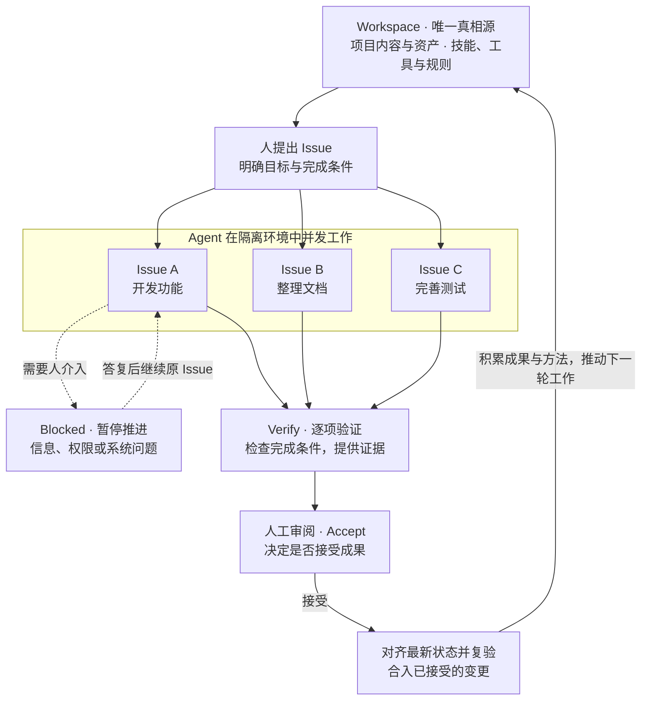

<p>
  
</p>

# Foundry

**以 Workspace 为唯一真相源，让 Agent 并发工作，经验证与人工接受，推动项目成果与工作能力共同演进。**

简体中文 | [English](docs/README.en.md)

[快速开始](#快速开始) · [文档](#文档) · [路线图](#roadmap) · [反馈问题](https://github.com/BD777/foundry/issues)

Foundry 是一个让 Agent 围绕同一项目协作的 AI 工作平台。你提出目标，Agent 可以同时开发功能、整理文档、完善测试；经过验证并由你接受的成果回到 Workspace，成为下一次工作的基础。

## 工作方式

Workspace 保存项目的内容，也保存 Agent 使用的技能、工具和规则。下面这张图展示了它如何在一次次工作中持续演进：



Blocked 必须带具体原因，例如 Needs input、Needs permission、System error；解决后继续原 Issue，其他 Issue 可照常推进。图中以 Issue A 示意这一分支。短暂自动重试和容量等待仍可作为执行进度，执行确实无法继续时进入 Blocked。

每项 Issue 独立验证、审阅与接受；需要修改时，反馈回到该 Issue 继续推进。Verify 优先使用确定性检查，并保留需要模型或人工判断的依据；Accept 由人决定。**已接受的项目状态以 Workspace 为准，产品成果与可复用的工作能力在这里共同积累。**

## Roadmap

目标形态见 [Workspace 与 Sandbox 总纲](docs/workspace-sandbox-overview.md)：人提出 Issue，Agent 在 Sandbox 中完成并拿出证据，经人接受后合入 Workspace。开发按[模块化架构](docs/architecture-modules.md)的依赖顺序切分为 Milestone：每个 Milestone 交付一个模块的协议，并用一个端到端场景验收。每项链接到设计与完成标准；已实现的边界与已知缺口见[当前状态](docs/current-status.md)。

### 已可用

- [x] [Chats](docs/chat-experience.md)：基于原生 Claude / Codex Harness 的 Web Chat，直接在所选 Workspace 中工作，支持附件、排队输入、steer、中断恢复、分组与检索。
- [x] [会话编排](docs/session-orchestration-design.md)：Agent 通过 `foundry` CLI / MCP 创建、steer、交接其他会话，支持 worktree 会话、fork 与只读 verifier。
- [x] Workspace Skills：设备扫描本地 Skill 并推送到服务器目录，Workspace 按版本选择启用，依赖随之启用；Agent 只看到当前 Workspace 启用的 Skill。
- [x] [飞书 Bot](docs/platform-extensions.md#im-integration)：每个 Workspace 配置自己的 Bot 并配对群，群内话题对应会话，回复以流式卡片更新；群以生成配对码的账号身份和权限执行。
- [x] [账号与 Workspace 共享](docs/security.md#accounts)：所有接口要求登录，设备凭证与资源归属，按 Viewer / Member / Maintainer / Owner 共享 Workspace。
- [x] [设备与部署](docs/development.md)：Daemon 主动连接 Server，多设备、多 Workspace，macOS / Linux 进程隔离；支持 [Docker 部署](deploy/README.md)与[并行开发栈](docs/dev-stacks.md)。
- [x] Issue 引擎：准出条件 → 候选执行 → 证据与验证 → 接受 → 合入已在主干并有历史闭环记录；Agent 澄清、独立判定与合入目前仅在 macOS 开通，Web 入口在体验打磨完成前暂时隐藏。

### M1 执行内核

一套沙箱、一种启动 Agent 的方式。Chat 继续直接在 Workspace 中工作；隔离只用于 Issue 这类编排流程。

- [ ] [Linux 上的完整 Issue 闭环](docs/architecture-modules.md#5-m1-接口草案)：在 Linux 开放 Agent 澄清、独立判定、Accept 与合入，与 macOS 使用同一套隔离定义。
- [ ] [编排子会话隔离](docs/architecture-modules.md#52-session-runtime)：带 Issue 的编排子会话与 Issue 执行受同一隔离约束，只能写该 Issue 的候选。
- [ ] [统一会话记录](docs/architecture-modules.md#53-server-侧run-与-agentsession-统一)：Issue 执行、澄清与判定和 Chat 共用同一套会话记录，可读取、steer 与追溯。

### M2 Agent 能力面

- [ ] [Issue 内编排](docs/session-orchestration-design.md)：Issue 执行 Agent 通过 `foundry` MCP 派出子会话与独立 verifier，血缘与证据归属可追溯。
- [ ] [Foundry MCP / CLI](docs/session-orchestration-design.md)：作为 Agent 唯一的对外接口，能力按统一 policy 注册与授权；HTTP MCP 支持 OAuth 2.1。

### M3 Issue Loop v2

- [ ] [Loop graph 与准出规则](docs/issue-workflow.md#issues)：Issue 的状态流转收敛为一份显式定义；准出规则带编号与版本并写入审阅快照，可在实践中扩充。
- [ ] [准出条件](docs/issue-workflow.md#issues)：Agent 结合 Workspace 上下文起草、人修改并确认具体版本；修改须写明理由并重新确认。
- [ ] [人工介入（Blocked）](docs/issue-conversation-design.md)：通用的提问与权限应答协议，回应后继续同一个 Issue。
- [ ] [外部反馈与飞书中的 Issue](docs/platform-extensions.md#im-integration)：反馈可来自人、Agent 以外的来源（首个为飞书话题或 CI），带来源记录回到 Issue；在飞书话题里发起、跟进并回应 Blocked，复杂审阅回到 Web。
- [ ] [证据与验证](docs/issue-workflow.md#evidence-and-verify)：补齐 [v1 §9](docs/evidence-and-verify-v1.md) 的剩余项；采集方式通过统一接口扩展。
- [ ] [接受与合入](docs/issue-workflow.md#accept-and-integration)：打磨 Merge Queue 的冲突解决与复验。
- [ ] [Issue Web 体验](docs/issue-workflow.md#issues)：重新开放 Issues 入口，打磨 Board、详情与 Issue 对话。
- [ ] [开源首发](docs/issue-workflow.md#open-source-release)：用代表性真实任务跑通完整闭环，在干净环境中复现安装。

### M4 资源与跨设备

- [ ] [Resource Pool 与 Tool Use](docs/tool-use-and-resources.md#basic-tool-use)：浏览器、桌面（Computer Use）、模拟器与真机、端口与服务、内部 Infra 统一走“申请 → 使用 → 释放 → 清理”，同时采集证据；首个接入浏览器。
- [ ] [跨设备会话](docs/architecture-modules.md#3-模块清单)：经 Server 中转，在另一台设备上启动会话、使用其资源；凭据留在所在设备，每次调用按 policy 授权。

### 并行轨道

- [ ] [账号与权限后续阶段](docs/accounts-permissions-design.md)：飞书身份登录并按发送者本人授权、个人连接授权给 Workspace、审计与所有权转移、设备密钥对认证。
- [ ] [Sandbox 隔离补全](docs/workspace-sandbox-overview.md)：Docker 容器隔离；凭据不以明文交给 Agent；部署、发消息等外部副作用按次授权。

### 探索（未排期）

- [ ] [Workflow 插件化](docs/platform-extensions.md#workflow-plugins)：Issue 作为内置 Workflow，开放侧边栏 Tab、Workflow 定义等扩展接口，让用户按自己的方式组织工作。
- [ ] [Issue 多 Agent 协作](docs/issue-workflow.md#issue-multi-agent)：同一 Issue 的不同步骤交给不同 Agent 或 Harness，对用户仍是一段对话。
- [ ] [跨 Host 资源调度](docs/tool-use-and-resources.md#shared-resource-scheduling)：多台机器共享执行与验证资源，支持异地验证。
- [ ] [通用 IM 接入](docs/platform-extensions.md#im-integration)：抽出 Bot Adapter，接入飞书以外的 IM。
- [ ] [云端 Workspace](docs/platform-extensions.md#cloud-workspace)：托管项目文件与持久状态，不同执行端按权限访问同一个逻辑 Workspace。

## 快速开始

### 环境准备

- Node.js 22
- pnpm 11.7.0
- Go 1.24.0 或更高版本（以 [go.mod](apps/server/go.mod) 为准）
- Git；本地 Worker 支持 macOS 和 Linux，Linux 的 Issue 执行需要 bubblewrap 和可用的 user namespace。Issue 的 Agent 澄清、独立判定与 Accept 集成目前只在 macOS 开通，Linux 上会显式拒绝执行；Chat 在两个平台都可用。

### 安装与启动

```bash
git clone https://github.com/BD777/foundry.git
cd foundry
pnpm install
```

在两个终端中分别启动服务端和 Web 应用：

```bash
pnpm dev:server
```

```bash
pnpm dev:web
```

打开 [http://127.0.0.1:31983](http://127.0.0.1:31983/)。

### 连接本地 Worker

服务端启动后，将下方路径替换为你的 Workspace 路径，执行初始化、配对与本地守护进程安装：

```bash
pnpm --filter @foundry/worker foundry-worker -- setup --server http://127.0.0.1:31982 --workspace /absolute/path/to/workspace
```

随后在界面中配置本地 Claude 或 Codex Profile。更多安装选项、认证配置、预览与排查说明见[开发指南](docs/development.md)。

## 项目结构

```text
apps/web/          React / Vite 界面
apps/server/       Go API、SQLite 状态投影与 Worker 通信
packages/worker/   本地 Agent 执行、文件、worktree 与预览
packages/protocol/ 组件间共享协议
docs/              使用指南、产品设计、架构与研究
cases/             产品回归场景与验证要求
```

服务端负责控制与状态投影，Worker 负责实际执行。数据存放、凭据处理和远程访问规则见[安全边界](docs/security.md)。

## 文档

| 文档                                       | 内容                                    |
| ------------------------------------------ | --------------------------------------- |
| [文档索引](docs/README.md)                 | 全部文档的分类入口                      |
| [开发指南](docs/development.md)            | 安装、运行、Worker 配置与验证           |
| [并行开发栈](docs/dev-stacks.md)           | 多套 Foundry 同时开发的隔离栈与体检工具 |
| [当前状态](docs/current-status.md)         | 已有能力与已知缺口                      |
| [产品理念](docs/philosophy.md)             | 项目目标与工作闭环                      |
| [技术架构](docs/technical-selection.md)    | 组件职责与技术选型                      |
| [总纲](docs/workspace-sandbox-overview.md) | Workspace、Sandbox 与 Issue 的整体设计  |
| [路线图](#roadmap)                         | 后续工作与优先级                        |

## 参与贡献

欢迎通过 [Issue](https://github.com/BD777/foundry/issues) 反馈问题、讨论需求，或提交 Pull Request。问题反馈请尽量附上复现步骤、运行环境和相关日志，并移除凭据等敏感信息。

开始修改前，请阅读 [AGENTS.md](AGENTS.md) 和[开发指南](docs/development.md)；当前工作上下文见 [CONTEXT.md](CONTEXT.md)。提交前运行项目回归检查：

```bash
pnpm regression:commit
```

涉及可观察行为的功能或修复，请同步维护[回归场景](cases/README.md)。修改项目介绍或启动方式时，请同步更新[英文 README](docs/README.en.md)。

## 许可证

本项目基于 [Apache License 2.0](LICENSE) 开源。
