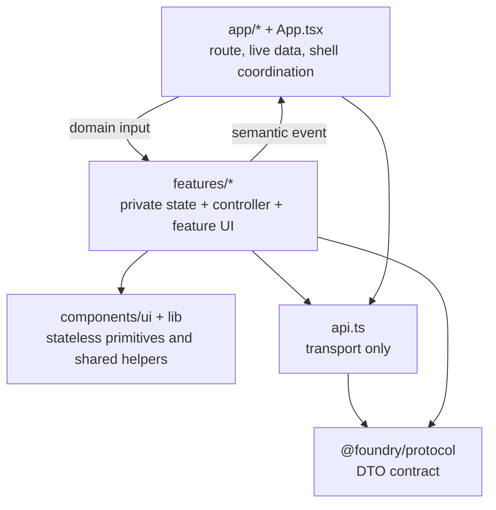

# Foundry Web Architecture

The frontend uses a feature-first architecture. A feature owns its interaction
state and implementation details, accepts domain inputs, and emits semantic
events. The app shell coordinates navigation and data shared across features.



## Ownership rules

### App layer

The app layer owns only state that coordinates multiple features:

- current route and workspace;
- the server projection shared by sidebar counts and several features;
- cross-feature requests, such as opening an issue draft from chat;
- global notices and theme.

Browser history, live-data batching/polling, and shared projection merging live
in focused hooks/modules under `app/`; `App.tsx` composes them instead of
implementing their state machines inline.

It must not own a page's filters, form drafts, expanded rows, directory lookup,
or other view-only state.

### Feature layer

Each folder under `features/` is a vertical slice. It may contain a facade,
private components, a controller hook, and domain presentation helpers.

A feature's public `index.ts` is its only public entry point. Feature-to-feature
imports are forbidden. Cross-feature communication goes through a typed event
handled by the app shell.

Examples:

```ts
type RunsFeatureEvent = {
  type: "run.selected";
  issueId: string;
  runId: string;
};
```

Events describe user or domain intent. They must not expose internal setters,
refs, drag state, loading maps, or component implementation details.

### Shared layer

`components/ui` contains reusable visual primitives and patterns. `lib` contains
pure shared helpers. Shared code cannot import the app layer or a feature.

If a component is useful only inside one feature, keep it private in that
feature instead of adding it to `components/ui`.

### Transport and protocol

`api.ts` performs HTTP/SSE transport. `@foundry/protocol` defines transport DTOs.
Feature view models may derive from protocol data, but UI-only state must not be
added to protocol DTOs.

## State placement test

Place state at the lowest owner that can make the decision:

1. Used by one component: keep it in that component.
2. Used by several components in one feature: keep it in the feature facade or
   a private controller hook.
3. Coordinates two features: lift only the semantic request/result to the app.
4. Comes from the server: keep it in the shared server projection/cache.

Passing an explicit input down and emitting a typed event up is preferred over
sharing mutable state or importing another feature's internals.

## Styling boundary

Feature selectors use a feature prefix such as `fdy-chat-*` or `fdy-issue-*`.
Shared visual tokens and primitives use their own stable prefixes. A feature
must not override another feature's selectors. Existing global CSS is migration
debt; when a feature is edited, move its selectors into a feature-owned style
file while preserving cascade order and visual audit coverage.

## Migration status

- `issues`, `runs`: composer/board and filter state are private; they emit
  typed issue and `run.selected` events. Runs remain an internal history view.
  The Issues sidebar entry is currently hidden; `/issues` renders the
  workspace overview.
- `workspaces`: path draft, directory suggestions, debounce and register/remove
  pending state are private; the active working location is chosen on the
  dedicated `/locations` page (`features/workspaces/workspace-selection-panel.tsx`).
- `assets`, `skills`, `devices`: feature facades expose semantic contracts
  instead of page JSX living in `App.tsx`. Device sections cover workspaces,
  skills, Models & accounts (official accounts vs server API connections) and
  device settings; workspace CRUD lives under the device, not in a switcher.
- `accounts`, `sharing`, `feishu`: sign-in and members, workspace role
  sharing, and the per-workspace Feishu bot (credentials and group pairing).
- `profiles`: server-owned endpoint profiles, device bindings and the
  selection-only model catalog UI; credential fields are write-only and never
  rendered back.
- `issue-detail`: contract confirmation cards, evidence materials,
  verification results, candidate review, environment and the issue
  conversation compose the issue surface; its evidence access goes through
  `evidence-api.ts`.
- `chat`: the controller owns attachments, selected agent, runtime overrides,
  model discovery, archived-session hydration, send/steer/cancel and message
  projection. The conversation UI itself (transcript stage, virtualization,
  turn navigator, queue, input hook, scroll follow) is shared in
  `components/conversation/` and used by both Chat and Issue detail; the chat
  feature folder holds projection adapters and re-export shims.
- `app`: browser routing, view scroll reset, live SSE batching/polling, and
  shared server-projection merging are isolated from feature code. Workspace
  scoping/selection (`workspace-selectors.ts`) and loaded-chat selection
  precedence (`chat-selection.ts`) are pure modules with unit tests; `App` keeps
  only the state and browser-coupled wiring around them.

`audit-feature-architecture.mjs` prevents cross-feature imports, shared-layer
back-dependencies, feature deep imports, feature-facade growth (350 lines),
feature modules over 1000 lines, and `App.tsx` growth beyond its 1200-line
shell budget.
