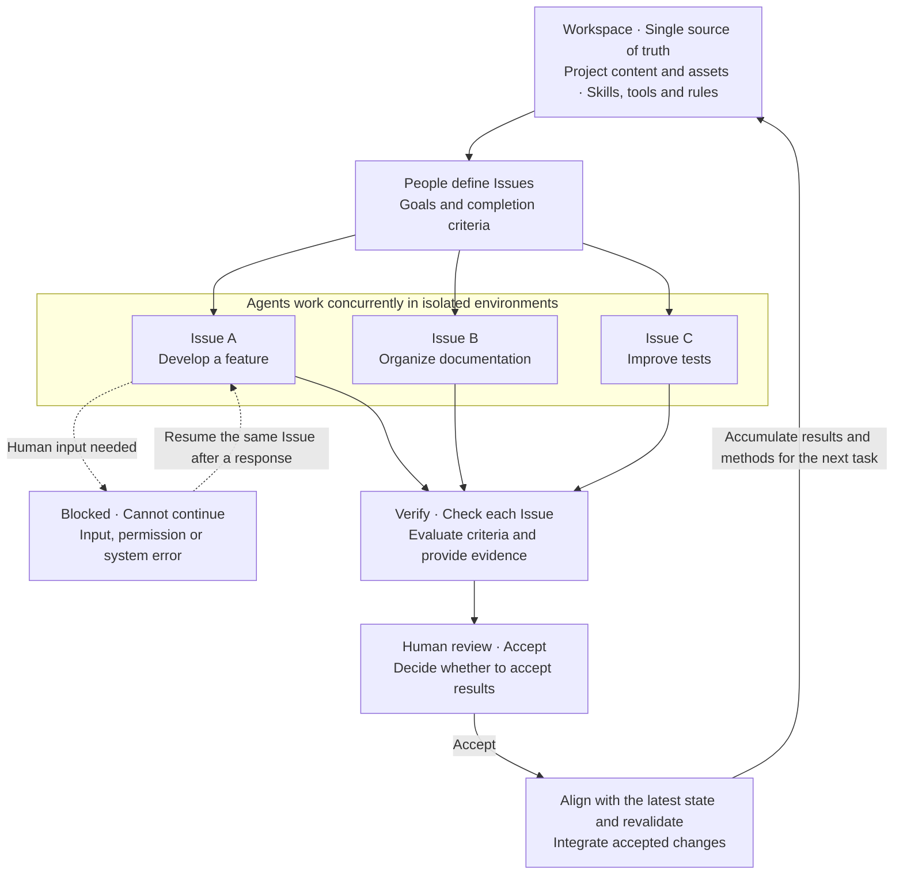

<p>
  
</p>

# Foundry

**A workspace as the single source of truth, where agents work concurrently and verified, human-accepted contributions advance both the project and its working capabilities.**

[简体中文](../README.md) | English

[Quick start](#quick-start) · [Documentation](#documentation) · [Roadmap](#roadmap) · [Report an issue](https://github.com/BD777/foundry/issues)

Foundry is an AI work platform where agents collaborate around a shared project. You set the goals; agents can develop features, organize documentation and improve tests concurrently. Verified results that you accept return to the workspace as the foundation for the next task.

## How it works

The workspace holds the project's content alongside the skills, tools and rules agents use. This diagram shows how it evolves through successive contributions:



Blocked carries a specific reason, such as Needs input, Needs permission or System error. Once resolved, the same Issue continues while other Issues progress independently. Issue A illustrates this branch. Temporary retries and capacity waits may remain execution progress; an execution that cannot continue becomes Blocked.

Each Issue is verified, reviewed and accepted independently. Feedback returns to the same Issue for further work. Verify prioritizes deterministic checks and retains the basis for model or human judgments; people decide whether to Accept. **The workspace is authoritative for the accepted project state, accumulating both product results and reusable working capabilities.**

## Roadmap

The target shape is described in the [Workspace and Sandbox overview](workspace-sandbox-overview.md) (Chinese): a person raises an Issue, an agent completes it in a Sandbox and produces evidence, and accepted results are integrated into the Workspace. Items below follow the overview's modules and link to their design and completion criteria. Implemented boundaries and known gaps are in [current status](current-status.md).

### Available

- [x] [Chats](chat-experience.md): Web Chat over native Claude / Codex harnesses, with attachments, queued input, steering, recovery, groups and search.
- [x] [Session orchestration](session-orchestration-design.md): agents create, steer and hand off other sessions through the `foundry` CLI / MCP, including worktree sessions, forks and read-only verifiers.
- [x] Workspace Skills: devices scan local skills and promote them to the server catalog; each workspace selects skill versions, with dependencies enabled alongside; agents only see the skills their workspace enables.
- [x] [Feishu bot](platform-extensions.md#im-integration): each workspace configures its own bot and pairs groups; group threads map to sessions and replies stream into cards; a group acts with the identity and permissions of the account that generated its pairing code.
- [x] [Accounts and workspace sharing](security.md#accounts): every API requires sign-in; device credentials and resource ownership; workspaces are shared as Viewer / Member / Maintainer / Owner.
- [x] [Devices and deployment](development.md): daemons connect out to the server; multiple devices and workspaces; macOS / Linux process isolation; [Docker deployment](../deploy/README.md) and [parallel dev stacks](dev-stacks.md).

### In progress: the Issue loop

The Issue engine (completion criteria → candidate execution → evidence and verification → acceptance → integration) is on main with historical end-to-end records. Its web entry is hidden until the experience is polished.

- [ ] [Issue web experience](issue-workflow.md#issues): reopen the Issues entry and polish the board, detail view and Issue conversation.
- [ ] [Completion criteria](issue-workflow.md#issues): the agent drafts them from workspace context; a person edits and confirms an exact version; any later change needs a stated reason and a new confirmation.
- [ ] [Human input (Blocked)](issue-conversation-design.md): a general question and permission-response protocol; answering resumes the same Issue.
- [ ] [Evidence and verification](issue-workflow.md#evidence-and-verify): close the remaining items in [v1 §9](evidence-and-verify-v1.md) and enable agent clarification and independent judgments on Linux.
- [ ] [Acceptance and integration](issue-workflow.md#accept-and-integration): enable Accept and integration on Linux; polish Merge Queue conflict resolution and reverification.
- [ ] [Issues in Feishu](platform-extensions.md#im-integration): raise Issues, follow progress and answer Blocked states from Feishu threads; complex review returns to the web.
- [ ] [First open-source release](issue-workflow.md#open-source-release): run the full loop on representative real tasks and reproduce installation in a clean environment.

### Next

- [ ] [Complete Sandbox isolation](workspace-sandbox-overview.md): Docker container isolation; no plaintext credentials handed to agents; per-action authorization for external side effects such as deploying or sending messages.
- [ ] [Resource Pool and Tool Use](tool-use-and-resources.md#basic-tool-use): browsers, desktops (Computer Use), simulators and devices, ports and services, and internal infrastructure share one request → use → release → clean-up lifecycle, with evidence capture.
- [ ] [Later account phases](accounts-permissions-design.md): Feishu sign-in with per-sender authorization, personal connections authorized per workspace, auditing and ownership transfer, and device key-pair authentication.

### Exploring (unscheduled)

- [ ] [Workflow plugins](platform-extensions.md#workflow-plugins): ship Issues as the built-in workflow and expose extension points such as sidebar tabs and workflow definitions, so people can organize work their own way.
- [ ] [Multiple agents within an Issue](issue-workflow.md#issue-multi-agent): assign steps of one Issue to different agents or harnesses while keeping one conversation.
- [ ] [Cross-host resource scheduling](tool-use-and-resources.md#shared-resource-scheduling): share execution and verification resources across machines, including remote verification.
- [ ] [General IM integration](platform-extensions.md#im-integration): extract a Bot Adapter and support IMs beyond Feishu.
- [ ] [Cloud workspace](platform-extensions.md#cloud-workspace): host project files and persistent state so different execution environments access one logical workspace with appropriate permissions.

## Quick start

### Prerequisites

- Node.js 22
- pnpm 11.7.0
- Go 1.24.0 or later, as declared in [go.mod](../apps/server/go.mod)
- Git; local workers support macOS and Linux. Issue execution on Linux requires bubblewrap and a working user namespace. Issue clarification, independent-agent verification and Accept integration are enabled on macOS only and explicitly refused on Linux today; Chat works on both.

### Install and run

```bash
git clone https://github.com/BD777/foundry.git
cd foundry
pnpm install
```

Start the server and web app in separate terminals:

```bash
pnpm dev:server
```

```bash
pnpm dev:web
```

Open [http://127.0.0.1:31983](http://127.0.0.1:31983/).

### Connect a local worker

With the server running, replace the path below with your workspace path to initialize it, pair the device and install the local daemon:

```bash
pnpm --filter @foundry/worker foundry-worker -- setup --server http://127.0.0.1:31982 --workspace /absolute/path/to/workspace
```

Then configure a local Claude or Codex profile in the interface. See the [development guide](development.md) for installation options, authentication, previews and troubleshooting.

## Project structure

```text
apps/web/          React / Vite interface
apps/server/       Go API, SQLite projections and worker communication
packages/worker/   Local agent execution, files, worktrees and previews
packages/protocol/ Shared component protocols
docs/              Guides, product design, architecture and research
cases/             Product regression scenarios and verification requirements
```

The server handles coordination and state projections; workers perform execution. See the [security boundary](security.md) for data placement, credential handling and remote access rules.

## Documentation

| Document                                         | Contents                                                                        |
| ------------------------------------------------ | ------------------------------------------------------------------------------- |
| [Documentation index](README.md)                 | All documentation, organized by topic                                           |
| [Development guide](development.md)              | Installation, startup, worker configuration and verification                    |
| [Parallel dev stacks](dev-stacks.md)             | Isolated stacks for running multiple Foundry copies, with doctor/repair tooling |
| [Current status](current-status.md)              | Available capabilities and known gaps                                           |
| [Product philosophy](philosophy.md)              | Project goals and the work loop                                                 |
| [Technical architecture](technical-selection.md) | Component responsibilities and technology choices                               |
| [Overview](workspace-sandbox-overview.md)        | Overall design of Workspace, Sandbox and Issues (Chinese)                       |
| [Roadmap](#roadmap)                              | Upcoming work and priorities                                                    |

## Contributing

Use [Issues](https://github.com/BD777/foundry/issues) to report bugs or discuss requests, or submit a Pull Request. Include reproduction steps, your environment and relevant logs when reporting a problem, and remove credentials or other sensitive information.

Before making changes, read [AGENTS.md](../AGENTS.md) and the [development guide](development.md). Current working context is in [CONTEXT.md](../CONTEXT.md). Run the regression gate before submitting changes:

```bash
pnpm regression:commit
```

Update the [regression catalogue](../cases/README.md) for features or fixes that change observable behavior. Keep this README and the [Chinese README](../README.md) in sync when updating the project introduction or startup instructions.

## License

Foundry is licensed under the [Apache License 2.0](../LICENSE).
