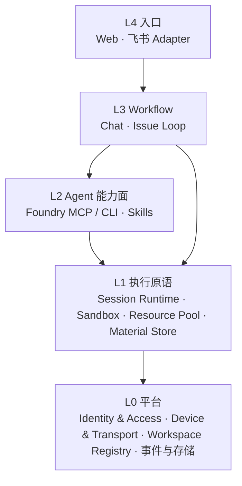
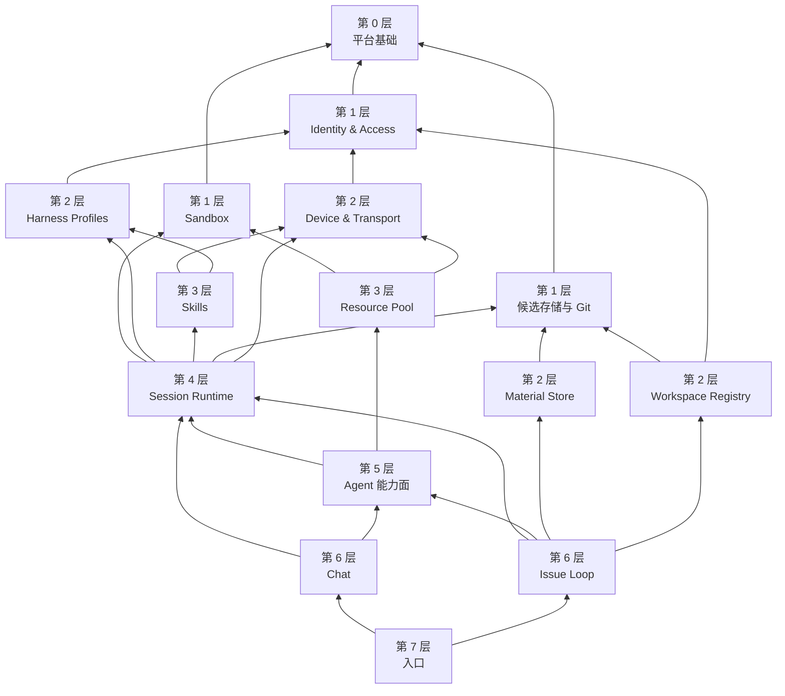

# 模块化架构与开发切分

[项目 Roadmap](../README.md#roadmap) · [文档索引](README.md) · [当前状态](current-status.md)

状态：设计，2026-09-25 确定方向。本文同时是**系统框架的模块划分**和**开发进度的切分依据**：
每个 milestone 交付一个模块的协议，并用一个真实使用方场景验收。现状描述基于 `0649fe7`
的源码阅读（code-evidence，路径已附），未重新运行服务。

## 1. 为什么要切

现在的问题不是某个模块写得不好，而是**切分维度错了**：代码按进程分层（web / server /
worker / protocol），不按领域分。每个功能都要纵穿四层，并经过同几个枢纽文件，于是
任何改动都牵连其他模块。

| 现象                         | 证据                                                                                                                                                                                                                |
| ---------------------------- | ------------------------------------------------------------------------------------------------------------------------------------------------------------------------------------------------------------------- |
| 同一原语多处实现：启动 Agent | Chat 走 `runner.ts`；Issue 执行走 `issue-executor.ts` → `issue-executor-child.ts`（复用 runner 但另起进程、另拼环境）；澄清与判定走 `evidence-agent.ts` `runEvidenceStageSession`（直接调 SDK、自拼 env、自拷凭据） |
| 同一原语多处实现：沙箱       | `execution-sandbox.ts`（候选写）、`evidence-agent-sandbox.ts`（阶段只读，仅 macOS）、`evidence-command-sandbox.ts`（检查命令，macOS + Linux）、`evidence-http-service.ts`（受控服务，仅 macOS）                     |
| 同一概念两套记录             | Server 有 `Run`（Issue 执行，`store/models.go`）与 `AgentSession`（Chat/编排）两套执行记录；daemon 消息也分 `run_issue/run_event/issue_completed` 与 `run_session/session_*` 两条管线                               |
| 枢纽文件                     | `daemon_ws.go` 1896 行、`daemon-connection.ts` 1927 行、`runner.ts` 1753 行；`httpapi/` 平铺 74 个文件；daemon 消息约 60 种类型共用一个无命名空间的词表（`protocol/src/daemon-messages.ts`）                        |
| 上层概念渗入下层             | 沙箱按 evidence 阶段命名和分支；session 需要认识 `issueId`；平台判断散落在 `evidence-acceptance.ts:38` 等调用处                                                                                                     |

直接后果（此前讨论中已确认）：

- **Orchestrator 进不了 Issue**：会话令牌与 foundry MCP 只随 `AgentSession` 注入
  （`profiles.ts` `sessionEnvironment()`），Issue 执行走 `Run`，`issue-executor.ts` 只注入
  repository socket。
- **Linux 上澄清、判定、合入不可用**：Linux 支持只补在了其中两处沙箱，阶段沙箱和 HTTP
  服务仍是 macOS 专有，合入处单独做了平台拒绝。（第 2 步已开放澄清、判定与合入；HTTP
  服务见第 2b 步。）
- **编排出的 Issue 子会话不受隔离**：带 `issueId` 的子会话在候选目录中运行
  （`daemon-connection.ts` `sessionExecutionPath`），但走 Chat 的 runner，没有经过
  `sandboxCommand`；同一个候选里，Issue 执行被隔离，子会话却不被隔离。（5b 已修复。）
- **Linux 候选沙箱没有控制面端口限制**：macOS profile 拒绝访问 Server/Web 端口
  （`controlNetworkRestrictions`），Linux bwrap 分支未 unshare 网络，也没有等价限制。
  第 2 步核实：沙箱内确实能连到控制面；之后复查确认这条规则已不必要并取消（见 §5.1）。
  同时发现并修复了
  三个 Linux 问题：沙箱内无法解析域名（未挂载 `/etc`，Agent 连不上模型 API）、候选沙箱能
  读到 Server 数据目录（数据库与 `foundry-secret.key`）、Issue Agent 连不上 Worker 的仓库
  工具 socket。

## 2. 分层与依赖规则



规则：

1. **依赖只能向下。** 下层不 import、不命名、不分支于上层概念（不出现 `issue`、
   `evidence`、`chat` 字样的分支）。上层差异通过参数（role、policy、profile）传入。
2. **跨模块只经公开接口。** 模块内部文件不被外部 import；协议类型放在
   `packages/protocol` 中按模块分文件。
3. **一种原语一处实现。** 启动 Agent 只经 Session Runtime；包装 `sandbox-exec` / `bwrap`
   只在 Sandbox 模块；平台判断只在 Sandbox 后端。
4. **边界由审计锁住。** 仿照 Web 的 `audit-feature-architecture.mjs`，给 Worker 和 Server
   加依赖方向审计；已存在的违例登记为只减不增的基线。

## 3. 模块清单

| 层  | 模块               | 负责                                                                  | 不知道                 | 现有代码                                                                                           |
| --- | ------------------ | --------------------------------------------------------------------- | ---------------------- | -------------------------------------------------------------------------------------------------- |
| L0  | 平台基础           | 配置、私有状态根、原子写、通用工具；共享协议包                        | 任何业务概念           | `config.ts`、`state-root.ts`、`storage.ts`、`utils.ts`、`packages/protocol`                        |
| L0  | Identity & Access  | 账号、actor、角色、policy、会话令牌                                   | 具体业务对象的流程     | `internal/accounts`、`httpapi/actor.go`、`policy.go`、`access.go`、`sqlitestore/session_tokens.go` |
| L0  | Device & Transport | 配对、daemon 通道、RPC 关联、按设备路由                               | 消息的业务含义         | `daemon_ws.go`、`daemon_rpc.go`、`daemon-connection.ts`、`transport.ts`                            |
| L0  | Workspace Registry | Workspace 身份、所在设备、仓库清单、登记与移除                        | 候选、Issue            | `workspace-*.ts`、`repository-registry.ts`                                                         |
| L1  | 候选存储与 Git     | 执行根目录布局、锁、worktree 与 Git 操作                              | Issue 的状态与流程     | `execution-storage.ts`、`execution-git.ts`、`execution-types.ts`（现以 Issue 命名，实为共享底层）  |
| L1  | Harness Profiles   | Claude / Codex profile、原生登录与账号检查、模型目录                  | 会话如何启动与运行     | `profiles.ts`、`native-*.ts`（除 `native-chat*`）、`models.ts`、`provider-health.ts`               |
| L1  | Skills             | Skill 扫描、下载、物化、按 Workspace 隔离                             | 哪个会话在用           | `skill-*.ts`、`internal/skillarchive`、`sqlitestore/skill*.go`                                     |
| L1  | Sandbox            | 按隔离 profile 包装进程；平台后端；探测与 fail closed                 | 谁在用、为什么用       | 见 §1 四处实现                                                                                     |
| L1  | Session Runtime    | 以统一规格启动 Claude/Codex，事件流、steer、cancel、恢复、transcript  | Issue、Chat 的流程语义 | `runner.ts`、`sdk-messages.ts`、`session-*.ts`、`evidence-agent.ts` 中的启动部分                   |
| L1  | Material Store     | 按内容寻址的材料存储、摘要校验、归属与可用性                          | 判定规则               | `evidence-store.ts`、`evidence-uploads.ts`                                                         |
| L1  | Resource Pool      | 申请 → 使用 → 释放 → 清理；资源身份与占用                             | 由哪个 Workflow 使用   | 未实现                                                                                             |
| L2  | Agent 能力面       | Agent 唯一的对外 API（MCP / CLI），capability 注册，统一经 policy     | 调用它的 Workflow      | `foundry-cli.ts`、`foundry-mcp.ts`、`foundry-client.ts`、`httpapi/mcp.go`                          |
| L3  | Chat               | 会话列表、分组、对话 UI 所需的投影                                    | 沙箱与启动细节         | `sqlitestore/chat_*.go`、`apps/web/src/features/chat`                                              |
| L3  | Issue Loop         | 契约、候选、采集、判定、准出规则、Accept、合入；loop graph 与信号入口 | 沙箱与启动细节         | `issue-*.ts`、`evidence-*.ts`（除启动与沙箱部分）、`sqlitestore/issue*.go`、`evidence*.go`         |
| L4  | 入口               | Web、飞书；未来的通用 IM Adapter                                      | 执行细节               | `apps/web`、`internal/feishu`                                                                      |

两个不单列为模块的能力：

- **Orchestrator** = Session Runtime + Agent 能力面。任何经 Session Runtime 启动、policy
  允许的会话都自动具备编排能力，不为 Issue 另做一套。
- **跨设备** = Transport 按 `deviceId` 路由 + Session / Resource 可以落在其他设备。上层
  只多一个目标设备参数。

## 3.1 依赖图

箭头表示"依赖于"。按拓扑序从没有依赖的模块开始往上叠：下一层只依赖已经做好的层。



图中省略了指向第 0 层和 Identity 的大部分边。Resource Pool 在第 3 层，但它还没有实现，
而且只有 M4 的场景需要它，所以不按层序提前做。

### 现状中的违例

以下来自 `0649fe7` 的 Worker import 扫描（按上表把文件归入模块后统计跨模块 import）。
Server 的 `httpapi` 是单个 Go 包，模块之间没有编译期边界，这部分只能按文件核对。

| 违例                          | 证据                                                                                                                               | 处理                                                 |
| ----------------------------- | ---------------------------------------------------------------------------------------------------------------------------------- | ---------------------------------------------------- |
| Sandbox 依赖上层类型          | `execution-sandbox.ts` 接收 `IssueEnvironment`；`evidence-command-sandbox.ts` 引用 `evidence-collectors.ts` 的 `CommandInvocation` | 改为只接收 `SandboxProfile`（M1 第 1 步）            |
| 共享底层以 Issue 命名         | `execution-storage.ts`、`execution-git.ts`、`execution-types.ts` 被沙箱、材料、工作区、会话共用                                    | 独立为"候选存储与 Git"，类型中去掉 Issue 概念        |
| Harness Profiles 依赖 Session | `profiles.ts` 导入 `session-ambient.ts`，并定义 `sessionEnvironment()`                                                             | 会话环境变量移入 Session Runtime                     |
| Workspace 依赖 Issue 与 Chat  | `workspace-ops.ts` 导入 `issues.ts`、`native-chat.ts`                                                                              | 它实际上是 daemon 请求处理，归入组装层               |
| 通道与装配混在一起            | `daemon-connection.ts` 既收发消息，又装配所有模块的请求处理                                                                        | 拆成通道与组装层：通道只管收发，各模块注册自己的处理 |

组装层（composition root）不是模块：`cli.ts`、`daemon-connection.ts` 中的装配部分、
`workspace-ops.ts` 这类请求处理可以依赖任何模块，但任何模块都不能依赖它。

## 4. Milestone 切分

每个 milestone：一个模块的协议 + 迁移现有调用方 + 删除重复实现 + 一个端到端使用场景。
模块自身的契约测试通过但场景未跑通，不算完成。

| Milestone            | 模块                                                       | 验收场景                                                                                               | 依赖           |
| -------------------- | ---------------------------------------------------------- | ------------------------------------------------------------------------------------------------------ | -------------- |
| **M1 执行内核**      | Sandbox + Session Runtime（含 Server 侧 Run/Session 统一） | 在 macOS 与 Linux 上各跑通一次完整 Issue 闭环：澄清 → 执行 → Agent 判定 → Accept → 合入；Chat 回归不变 | —              |
| **M2 Agent 能力面**  | Foundry MCP / CLI                                          | Issue 执行 Agent 经 MCP 派出子会话并由独立 verifier 判定，血缘、证据归属可追溯                         | M1             |
| **M3 Issue Loop v2** | Issue Loop                                                 | 朴素 loop graph 成为代码中的唯一转移表；准出规则带 id、版本并写入审阅快照；接入一个外部信号来源        | M1、M2         |
| **M4 资源与跨设备**  | Resource Pool + Transport 路由                             | 接入一种资源（优先浏览器）并产出截图证据；经 Server 中转在另一台设备上启动会话                         | M1、M2         |
| 并行轨道             | Identity & Access                                          | 账号 P3 / P4（个人连接授权、飞书身份绑定、审计、所有权转移）                                           | 与主线无强依赖 |

M2–M4 的接口在各自开始前补充到本文，不提前设计。

## 5. M1 接口草案

### 5.1 Sandbox

已实现，代码在 `packages/worker/src/sandbox/`。沙箱在 Worker 一侧，限制 Worker 为 Issue
启动的进程能读写哪些文件；Server 没有沙箱，Chat 不经沙箱。

**沙箱只管操作系统才拦得住的两件事（2026-09-26 定）：**

1. **写边界**：Issue 只写自己的候选与 scratch，保护真实 Workspace 与并行的 Issue；澄清与
   判定对所看内容只读。
2. **治理状态不可读**：Foundry 自己的状态目录（设备凭据、daemon 配置、其他 Issue 的候选与
   证据、各开发栈的状态）和运行目录下的 Server 数据（数据库、`foundry-secret.key`）。

其余的不归沙箱：

- **职责分离**（干活的 Agent 不能判定自己的结果）由身份与流程保证：Agent 的会话令牌只能
  访问会话相关接口（`httpapi/policy.go` `agentRouteAllowed`），确认准出条件、验证结果和
  Accept 都不对它开放；Verifier 的结论之所以算数，是因为 Worker 为已封存的候选启动独立
  会话并记录其输出，而不是 Verifier 持有凭据。
- **控制面端口不再封锁。** 这条规则来自 Server 允许免登录、能连上就有全部权限的时期；
  2026-09-23 起所有接口都要求登录，它已不再必要。编排中的 Agent 凭会话令牌访问 Server。
  （复查时发现的 Vite 开发服务器泄露 Server 数据的问题，已在 Vite 配置中修复。）
- **任务凭据按发起人决定。** `WritableTreeProfile.userFiles`：Issue 由设备所有者本人发起
  时为 `readable`，进程能像在本人终端里一样读取 home、配置与凭据（如 feishu-cli、ssh）；
  其他人发起的 Issue 为 `hidden`，只能看到系统目录、读根与写根。由 Server 在派发
  `run_issue` 时判断。给他人 Issue 使用某项凭据的显式授权属于账号 P3；外部副作用的按次
  确认属于后续 Tool Use。`readable` 下浏览器 cookie 等宿主上的其他凭据同样可读，需要更强
  隔离时使用 `hidden` 或计划中的 Docker 后端。
- **能运行自己的工具。** `WritableTreeProfile.executables` 列出进程要运行的程序（如 Agent
  CLI），无论 `userFiles` 如何，其安装目录都可读；Session Runtime 在宿主上解析 harness
  CLI 的真实路径后传入。此前 CLI 装在 home 下（原生安装器默认 `~/.local`）时，Issue 执行
  在沙箱内找不到 CLI。

**对使用方：一种调用形态。** 调用方只描述路径和限制，四种 profile、所有后端都用同样的
调用；后端由模块选择，调用方看不到。

```ts
// 四种 profile，按用途区分，字段只有路径和限制
type SandboxProfile =
  | WritableTreeProfile //   Issue 执行、preview：只写候选与 scratch；userFiles 决定能否读用户文件
  | ReadonlyAgentProfile //  澄清、判定：只读 Workspace / 候选，只写私有 home
  | OfflineCommandProfile // 检查命令：断网，只写输出目录
  | LoopbackServiceProfile; // 受控 HTTP 目标：只能在本机回环上监听

function sandboxLaunch(profile, command, args): SandboxLaunch; // 命令行
function sandboxLauncher(profile, command, launcherFile): string; // 给只接受可执行路径的 SDK
function sandboxAvailable(kind): boolean;
// 无可用后端或输入无效时抛 SandboxError（带 code），永不回退到无隔离执行
```

**对实现方：一个后端接口。** 每种隔离技术实现 `SandboxBackend`：声明自己验证过哪些
profile，并把 profile 翻译成本平台的规则。与平台无关的步骤（解析可执行文件、校验工作目录、
生成启动脚本、命令安装目录可读）在模块公共层完成，后端拿到的是已规范化的输入。

```ts
interface SandboxBackend {
  id: string;
  kinds: readonly SandboxKind[];
  launch(
    profile: SandboxProfile,
    command: string,
    args: string[],
  ): SandboxLaunch;
}
```

| 后端                 | writable_tree | readonly_agent | offline_command | loopback_service   |
| -------------------- | ------------- | -------------- | --------------- | ------------------ |
| macOS Seatbelt       | ✅            | ✅             | ✅ 断网         | ✅ 只能回环监听    |
| Linux bubblewrap     | ✅            | ✅             | ✅ 断网         | 未实现（第 2b 步） |
| Docker（计划，见下） | —             | —              | —               | —                  |

原来的四个文件（`execution-sandbox.ts`、`evidence-agent-sandbox.ts`、
`evidence-command-sandbox.ts`、`evidence-http-service.ts`）现在只负责把 Issue / evidence 的
信息翻译成 profile，属于 Issue 模块（`evidence-agent-sandbox.ts` 已并入 Session Runtime）。

**Chat 不经沙箱，这是设计而非缺口。** Chat 是最基础的能力，可以接到任意 cwd：Web 上和
飞书话题里发起的 Chat 直接在原始 Workspace 中工作，产生的变更直接生效，不经候选、验证与
Accept。隔离、证据和人工接受是 Issue 这类编排流程提供的保证，不泛化到 Chat。Session
Runtime 把这一点显式写成 `sandbox: { kind: "host" }`，而不是"没写就是不隔离"。

**Docker 后端（计划，不在 M1）。** 作为第三种 `SandboxBackend`，按 Workspace 选择，面向
Linux 服务器、团队共用机器和需要可复现环境的项目：独立根文件系统与资源限额，宿主上的其他
凭据天然不可见。取舍：Agent 只能用镜像里的工具链；macOS 上经虚拟机运行，文件性能下降，
也做不了 iOS / macOS 项目，所以 macOS 默认仍用 Seatbelt；worktree 的 `.git` 指向主仓库
绝对路径，主仓库 `.git` 需按同一路径挂载；Worker 本身跑在容器里时需要挂载宿主
docker.sock，等于把宿主 root 权限交给 Worker。

### 5.2 Session Runtime

一个启动入口，差异全部由 role 推导出的 policy 表达。已实现的部分见 §5.4 的 5a：目前
`SessionRole` 只有 `clarification` / `verification`，其余角色随 5b、5c 迁入；下面的接口是
迁移完成后的目标形态。

```ts
type SessionRole =
  | "chat"
  | "orchestrated" // 由其他会话经 MCP 创建
  | "issue_execution"
  | "clarification"
  | "verification"
  | "utility"; // 命名、标题等

interface SessionSpec {
  sessionId: string; // Server 分配的 AgentSession id
  role: SessionRole;
  harness: "claude" | "codex";
  profileId: string;
  model?: string;
  cwd: string;
  sandbox: SandboxProfile | { kind: "host" };
  prompt: string;
  systemPrompt?: string;
  resume?: { nativeSessionId: string };
  responseSchema?: Record<string, unknown>;
  persistTranscript: boolean;
  foundryToken?: string; // 存在即注入 FOUNDRY_* 与 foundry MCP；是否下发由 Server 按 role 决定
  skills?: ManagedSkillRuntime;
}

interface SessionHandle {
  events: AsyncIterable<SessionEvent>; // 统一 delta / tool / blocked / native-id 事件
  steer(message: string): Promise<void>;
  cancel(): Promise<void>;
  result: Promise<SessionResult>; // text、structured、reportedModel、activity
}

function startSession(spec: SessionSpec): SessionHandle;
```

role 到 policy 的映射集中在一处（草案，实施时以现有行为为准逐项核对）：

| role            | 沙箱                                                                      | 工具                           | foundry MCP    | 项目指令 / Skills         |
| --------------- | ------------------------------------------------------------------------- | ------------------------------ | -------------- | ------------------------- |
| chat            | host                                                                      | profile 默认                   | 是             | 是                        |
| orchestrated    | Workspace 根目录为 host；带 `issueId` 为候选写（**现状未隔离，M1 补上**） | profile 默认                   | 是             | 是                        |
| issue_execution | 候选写                                                                    | profile 默认                   | **是（新增）** | 是                        |
| clarification   | 阶段只读                                                                  | Read / Grep / Glob             | 否             | 读项目指令，不加载 Skills |
| verification    | 阶段只读                                                                  | Read / Grep / Glob + 只读 Bash | 否             | 否                        |
| utility         | host（无工具，不需要沙箱）                                                | 无                             | 否             | 否                        |

进程模型按沙箱推导，不作为独立选项：

- **host 会话**（chat、不带 `issueId` 的 orchestrated、utility）：和现在一样在 Worker
  进程内运行，没有额外进程。
- **沙箱会话**（issue_execution、带 `issueId` 的 orchestrated、clarification、
  verification）：Worker 另起一个 Node 子进程运行 SDK，整个子进程在
  `sandbox-exec` / `bwrap` 内启动。这是 Issue 执行现在的做法。判定阶段现在的做法是只把
  `claude` / `codex` 可执行文件包进沙箱，SDK 本身留在沙箱外，M1 统一改为前者：一种机制
  同时约束 SDK 和它拉起的工具进程，stdio 上的 steer 协议和进程组回收都已有实现。

### 5.3 Server 侧：Run 与 AgentSession 统一

- Issue 执行、澄清、判定都创建 `AgentSession`，带 `role` 和 `issueId`。会话令牌、血缘、
  分组、transcript 读取全部复用现有实现。
- `Run` 保留为 Issue 侧的投影：`sessionId` + 环境信息（`environmentId`、`revision`、
  `executionCwd`），不再承载事件流。
- daemon 消息：`run_issue` / `run_event` / `issue_completed` 收敛到 `run_session` /
  `session_*`，Issue 相关字段作为 payload。旧记录只读兼容，按现有 `normalizeIssueStatus`
  的方式在读取时归一。
- 令牌按 role 下发：只有 chat、orchestrated、issue_execution 会得到 `foundryToken`；
  issue_execution 的令牌在 policy 中额外限定于本 Issue 的候选。

### 5.4 迁移顺序

按 §3.1 的层序自下而上，每一步都能单独合入，并保持现有行为：

0. **依赖审计**（已完成）：`pnpm audit:modules`（`scripts/audit-module-boundaries.mjs`）
   按 §3.1 检查 Worker 的跨模块 import、SDK 与沙箱命令的位置、Server 的包依赖和
   `store.Store` 方法数上限；现有违例记录在 `scripts/module-boundaries-baseline.json`，
   只能减少。之后每一步都应让基线缩短。
1. **Sandbox（第 1 层）**：建模块和 macOS 后端，把四处实现迁进去，只接收
   `SandboxProfile`；输出与现在逐字节一致的 profile（用快照测试锁定）。
2. **Sandbox 后端接口与 Linux 只读阶段**（已完成）：后端统一实现 `SandboxBackend`；
   Linux 实现 `readonly_agent`，修复 DNS、Server 数据可读、仓库工具 socket 与嵌套只读
   目录问题；`evidence-acceptance.ts` 的平台拒绝改由 `sandboxAvailable()` 决定。
   **2b.** Linux 的 `loopback_service`（受控 HTTP 目标）：服务放进无网络的命名空间，
   由 Worker 经 Unix socket 转接。
3. **候选存储与 Git（第 1 层）**：并入第 5 步按需处理。第 2 步之后 Sandbox 已不再依赖
   这些类型，剩下的只是把 `IssueEnvironment` 等类型改名（11 个文件、41 处引用），不消除
   任何违例；等 Session Runtime 真正需要时再调整。
4. **Harness Profiles（第 2 层）**（已完成）：`sessionEnvironment()` 移入 Session Runtime
   的 `session-ambient.ts`，附件提示移入 `session-prompt.ts`，profiles 不再依赖会话。
5. **Session Runtime（第 4 层）**，分三步：
   - **5a**（已完成）：新建 `src/session/`，对外只有 `startSession(spec)`；角色决定工具、
     项目指令与轮数（`policy.ts`），harness 适配器（`claude.ts`、`codex.ts`）实现同一个
     内部接口。澄清与判定迁入，`evidence-agent.ts` 不再接触 SDK，Worker 违例基线清零。
   - **5b**（已完成）：Session Runtime 增加工作区会话入口 `runWorkspaceSession`（Chat、
     编排子会话、Issue 执行），带沙箱时在沙箱内的宿主子进程（`session/host-child.ts`）
     中运行 SDK，steer 与取消仍经通用登记表。带 `issueId` 的编排子会话由 Issue 模块
     （`issue-sessions.ts`）决定：在候选工作区（不再是候选环境根目录）内、与 Issue 执行器
     同一沙箱中运行，并携带会话令牌，可继续编排。进程组管理移到平台层 `process-group.ts`。
   - **5c**：`startSession`（隔离的阶段会话）与 `runWorkspaceSession`（工作区会话）合并为
     一个按角色区分的入口，合并 `runner.ts` 与会话模块中重复的环境、凭据、模型选择与取消
     逻辑。
6. **Server 侧统一**：Run → AgentSession，会话相关的 daemon 消息收敛；Issue 执行获得
   foundry MCP。`daemon-connection.ts` 中会话部分拆出通道与组装层。

### 5.5 M1 验收

- **契约测试**：每种 profile 在两个平台上的可读、可写、网络边界各有正反用例；沙箱不可用时
  返回带类型的错误；每种 role 的工具与 MCP 注入符合 §5.2 的表格。
- **审计**：上述依赖审计通过，基线为零。
- **端到端**：在 macOS 和 Linux 上各跑一次完整 Issue 闭环，按
  [准出标准 G5](foundry-conversation-release-gate.md) 使用真实浏览器和真实模型，并记录证据。
  Chat 的对话、steer、取消与恢复做回归。
- **负向**：澄清会话写文件失败；判定会话改动候选即判失败；未就绪子仓库不可写；
  判定 role 拿不到 foundry 令牌；带 `issueId` 的编排子会话无法写候选之外的路径。

## 6. 不做

- 不一次性重排目录。先让接口和依赖方向成立，再按模块搬文件。
- 不在 M1 引入 Issue 多 Agent、loop graph、Resource Pool 或跨设备。这些都在后续 milestone，
  M1 只保证它们将来有唯一的落点。
- 不为统一抽象重写 Harness。Session Runtime 只是对现有原生 SDK / CLI 调用的收拢，模型
  请求仍只经原生 SDK 或 CLI。
