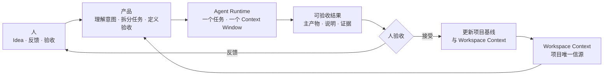

# 从 Idea 到可验收结果：以项目为主体的自主迭代理念

> 项目是持续演化的主体；人负责提出意图和验收结果；Agent 在珍贵的 Context Window 中完成一次任务。

## 简介

这是一套人、Agent 与项目协作的理念。人把一个尚未整理好的 Idea、问题或反馈直接投入项目，Agent 结合项目当前的 Workspace Context 把模糊意图起草为边界清楚、可以验收的任务，由人确认后交给 Codex、Claude Code CLI 等成熟 Agent Runtime 执行和验证，再把结果整理成一个清晰的可验收对象交还给人。人的接受、拒绝或反馈会改变项目基线，并成为 Workspace Context 的新状态。这套理念追求的不是让人更高效地管理 Agent，而是让项目能够在较少人工陪伴的情况下，持续从 Idea 推进到可验收结果。

## 迭代闭环

## 概念明晰

| 概念                     | 是什么                                                | 不是什么                       |
| ------------------------ | ----------------------------------------------------- | ------------------------------ |
| **项目**                 | 持续被建设、被改变和被验收的长期主体                  | 某一个 Agent 或某一段对话      |
| **Workspace Context**    | 项目当前状态的唯一信源，持续更新                      | 某一次 Agent 调用的临时 Prompt |
| **Agent Context Window** | Agent 在一次任务中保持关键信息和连续注意力的工作单元  | 项目的长期记忆                 |
| **Agent Runtime**        | 实际完成任务的执行能力，例如 Codex 或 Claude Code CLI | 需要被产品重新实现的对象       |
| **可验收结果**           | Agent 与人之间的交付界面，一个主要验收对象加必要证据  | 一堆日志、对话和零散文件       |

其中最容易混淆的是两种 Context。Workspace Context 是项目级的，回答"项目现在是什么"，它是每次验收后真正被更新的对象。Agent Context Window 是任务级的，回答"这一次执行能否可靠、连续地完成"，它是一种珍贵的执行资源——不要把 Agent 的可靠注意力浪费在反复解释背景、频繁切换任务和无意义的过程汇报上。具体如何维护任务级上下文，交给成熟的 Agent Runtime；产品要做的是给它一个边界清楚、可以连续推进、能够形成验收结果的任务。

## 与总纲的对应

本文讲理念；具体的对象、流程与术语以 [Workspace 与 Sandbox 总纲](workspace-sandbox-overview.md) 为准。两者的对应关系：项目及其 Workspace Context 即 **Workspace**；边界清楚的任务即 **Issue**，其验收标准即 **准出条件**；可验收结果即 Sandbox 中的 **候选** 与 **证据**；人验收即 **接受**，更新项目基线即 **合入**。
