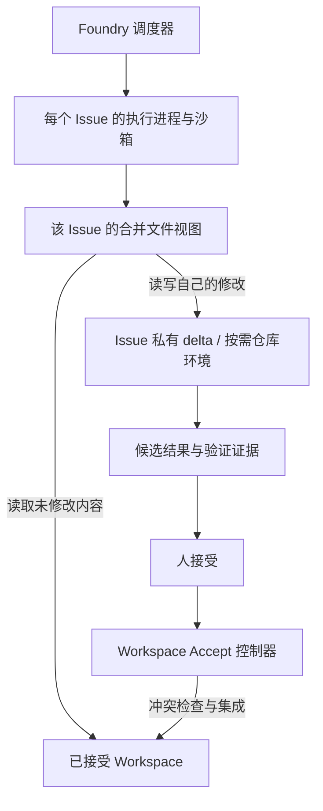

# Workspace 候选文件系统与写入约束调研

日期：2026-09-07。状态：方案讨论；仅文档与源码调研，没有安装、挂载、运行候选系统或修改 Foundry 执行代码。

后续方向更新：第一期收敛到 Git 管理的 Workspace，多仓必须同期支持。本文保留为非 Git 候选文件系统研究，不再作为第一期前置方案；多仓依据见 [submodule + worktree 调研与实验](git-submodule-worktree.md)，当前执行模型见 [Issue Workspace 执行](../issue-workspace-execution.md)。

## 结论

建议用「每个 Issue 的合并文件视图 + 进程级写入隔离 + Foundry 管理的 Workspace Accept」。CLI/MCP 提供操作入口，Hooks 提供语义检查与反馈；它们不能单独承诺任意本地程序的写入隔离。

最贴近需求的现成候选是 **Turso AgentFS**，值得优先做受控可行性验证，尚不应直接定为生产依赖。标准 Linux OverlayFS 不满足「底层源目录持续变化」的使用方式；macOS 原生执行还要验证路径、NFS 缓存和文件操作兼容性。

## 已确认的产品前提

- Workspace 是长期主体，包含代码、Rules、Docs、Know-how 和领域知识；Accept 将候选成果纳入 Workspace。
- 多个独立 Issue 在最大 Worker 执行容量内并行，Chat 与 Issue 共用容量。会话存在本身不占执行槽位。
- Workspace 可以是非 Git 目录，也可以在任意深度包含多个仓库；未涉及修改的仓库不应预先创建 worktree。
- Issue 共享已接受的项目背景，自己的修改保持私有。候选版本优先读取；未修改路径希望能跟进已接受内容。
- 不全量复制 Workspace。按需复制首次修改的文件、记录删除标记和目录元数据，是允许且必要的写时复制；这不等于零数据复制。
- 普通 Chat 直接写源目录会成为外部变更来源，Accept 和候选视图必须处理这种并发。

## 业界方案与适用边界

| 方案                      | 已有能力与来源                                                                                                                                                                                                                      | 对 Foundry 的判断                                                                                                                                          |
| ------------------------- | ----------------------------------------------------------------------------------------------------------------------------------------------------------------------------------------------------------------------------------- | ---------------------------------------------------------------------------------------------------------------------------------------------------------- |
| Claude Hooks              | 工具调用前检查或调整输入，调用后观察结果。[Hooks reference](https://code.claude.com/docs/en/hooks)                                                                                                                                  | 可检查运行环境、补充上下文、记录意图。允许一个 `Bash` 调用后，Hook 不会自动拦截其子程序的每次文件操作                                                      |
| CLI / MCP 文件工具        | AgentFS 同时提供 CLI 与 MCP 的文件接口。[CLI reference](https://docs.turso.tech/agentfs/reference/cli)                                                                                                                              | 可以承载统一文件 API；只约束通过这些接口发生的访问，不能自行限制其他 Shell 或外部工具                                                                      |
| Anthropic sandbox-runtime | 使用 OS 机制限制进程访问；Linux 使用 bubblewrap，macOS 使用 Seatbelt，支持包裹命令。[sandbox-runtime](https://github.com/anthropics/sandbox-runtime)                                                                                | 解决“是否允许写”，不提供候选内容的透明合并；应与文件视图配合                                                                                               |
| Linux OverlayFS           | lower/upper 合并、copy-up、whiteout；挂载期间直接修改底层文件系统属于未定义行为。[Kernel documentation](https://kernel.org/doc/html/latest/filesystems/overlayfs.html)                                                              | 适合稳定基线；不能直接把不断被 Chat 和 Accept 改写的 Workspace 当成活动 lower                                                                              |
| Turso AgentFS             | 自己实现 CoW 文件层；Linux 使用 FUSE/namespace，macOS 使用 NFS/Apple Sandbox；delta 存于数据库。[官方说明](https://turso.tech/blog/agentfs-overlay)、[手册](https://raw.githubusercontent.com/tursodatabase/agentfs/main/MANUAL.md) | 最接近整个 Workspace 的候选环境，需要验证动态基线、性能、Git 与权限例外；其 OverlayFS 实现不是 Linux 内核 OverlayFS                                        |
| Bazel sandboxfs           | 把多个原路径组成虚拟目录树，避免为每次执行建立大量物理目录或软链接。[设计说明](https://blog.bazel.build/2017/08/25/introducing-sandboxfs.html)                                                                                      | 是“执行视图”先例，不是现成的 Workspace Accept 系统；[仓库](https://github.com/bazelbuild/sandboxfs)列出的最新 release 为 2020 年，不能当作现代即插即用依赖 |
| Vercel just-bash          | 自己实现 Shell 与虚拟文件系统，可读真实目录、把写入留在内存；任意原生二进制执行需要其他环境。[README](https://github.com/vercel-labs/just-bash/blob/main/packages/just-bash/README.md)                                              | 可用于受控文本处理工具，无法直接替代需要 Go/Node/Git/系统 SDK 等任意工具的完整工作环境                                                                     |
| macFUSE / FSKit           | 可构建 macOS 用户态文件系统；macFUSE 的 FSKit 后端文档列出挂载位置、通知接口与性能限制。[后端文档](https://github.com/macfuse/macfuse/wiki/FUSE-Backends)、[Apple FSKit](https://developer.apple.com/documentation/fskit)           | 可作为 NFS 路线不满足需求时的替代验证方向，不能仅因是用户态就认为集成和兼容性成本低                                                                        |

以上适用性判断是对来源的工程推论，不是本地性能测试结果。

## 为什么不逐个 hook ls / cat

读取并不只发生在 `ls` / `cat`：`rg`、Git、语言运行时、编译器都会自行访问文件。写入也可能来自 Shell 重定向、Python 文件 API、格式化器的临时文件替换、子进程甚至已有的后台服务。

替换命令名或解析命令字符串无法完整表达这些行为。应让未改造的程序通过正常文件系统接口进入同一个候选视图，同时由 OS 限制逃出视图后的直接写入。MCP-only 可以是受限运行模式，但不能在仍开放任意宿主机 Shell 时承诺同等级约束。

建议职责：

- **CLI**：启动/恢复 Issue 执行环境，查看差异、刷新状态、导出候选结果。命令形态待设计。
- **MCP**：向 Agent 暴露受限的上下文查询、仓库准备、候选说明与请求验收能力。
- **Hooks**：提示环境边界、发现错误路径、触发语义级准备；不作为唯一写入防线。
- **文件系统层**：合并读取、写时复制、删除/重命名、目录列表，以及文件与路径身份。
- **进程沙箱**：约束 Issue 执行器及其子进程；只允许候选区和明确的临时区写入。
- **Accept 控制器**：唯一可以把该 Issue 的候选结果应用到源目录的组件，Worker 不持有调用最终接受操作的权限。

已有宿主机 MCP server、Docker socket、浏览器或 GUI 应用不一定是 Issue 子进程，因此不能假定它们自动受到同一沙箱约束。相关工具必须运行在该环境内，或由带 issue/environment 标识的代理限制文件落点与副作用。此项与后续 Browser/Computer 工具集合设计关联。[sandbox-runtime 对 Unix socket 的限制说明](https://github.com/anthropics/sandbox-runtime#security-limitations)

## AgentFS 源码核查

核查 revision：`0a014ebd4918615baff589ed17486e557e7c6a23`，GitHub API 返回提交日期 2026-06-03。以下结论限定于该 revision；项目 [README](https://github.com/tursodatabase/agentfs)仍标为 Beta。

- [overlayfs.rs](https://github.com/tursodatabase/agentfs/blob/0a014ebd4918615baff589ed17486e557e7c6a23/sdk/rust/src/filesystem/overlayfs.rs)：普通文件 copy-up 会读取原文件内容后写入 delta；有 whiteout 与 rename 处理。源码存在基于 base inode 的映射，不能据此推导出底层持续变动时所有缓存和文件句柄都即时一致。
- [linux.rs](https://github.com/tursodatabase/agentfs/blob/0a014ebd4918615baff589ed17486e557e7c6a23/cli/src/sandbox/linux.rs)：在子进程的 mount namespace 内，把候选视图 bind 到原工作目录路径。说明 Linux 路线可以保留进程所见的原绝对路径。
- [darwin.rs](https://github.com/tursodatabase/agentfs/blob/0a014ebd4918615baff589ed17486e557e7c6a23/cli/src/sandbox/darwin.rs)：将进程 cwd 设置到候选挂载点，允许文件读取并限制写入；另有临时目录和 Library 等较宽写入例外。不能原样套用到“任意位置的 Workspace 都受保护”的承诺，源目录若落在例外范围内必须拒绝或收紧策略。
- [NFS 挂载实现](https://github.com/tursodatabase/agentfs/blob/0a014ebd4918615baff589ed17486e557e7c6a23/cli/src/mount/nfs.rs)：macOS 使用本地 NFS 与 `locallocks`，并不是 Linux 式的私有 mount namespace。原绝对路径读取可能仍命中源目录，写入则应被沙箱拒绝；这是读写一致性的兼容边界。
- [Changelog](https://github.com/tursodatabase/agentfs/blob/main/CHANGELOG.md)曾修复 stale inode、FUSE 目录缓存和 NFS 挂载问题。这表明缓存/重挂载是实际工程问题，但不代表这些历史问题现在仍未修复，也不证明任意动态 base 已获保证。

结论：有可复用的技术基础，但尚未查到覆盖我们动态源目录、多仓库按需介入和 Workspace Accept 的完整保证。不得把项目自述的隔离能力扩大成“任何工具、任何路径都自动透明”。

## 推荐的 Foundry 结构（待定案）

结合当前 `packages/worker/src/runner.ts` 和 `adapters.ts` 的结构，一个重要边界是：**限制每个 Issue 的执行进程，不限制整个 Foundry daemon**。daemon 还要调度其他任务和处理接受；不能因某个 Issue 的策略改变其他 Issue 的读写权限。SDK 内置文件操作若发生在宿主进程内，也必须移入被约束的执行进程，不能只包裹它启动的 Bash。

源目录、候选存储和 Foundry 控制元数据应分开。运行时缓存/构建产物不是自动需要 Accept 的项目成果，需有独立 scratch 策略。禁止通过可写缓存路径、软链接、仓库元数据或控制 API 回写源目录。

### Git 仓库介入不能只是“第一次 write 时换挂载”

按需发现任意深度仓库可沿待操作路径向上解析实际仓库边界，也要识别 `.git` 文件、linked worktree 与 submodule，不能只查一层子目录。

建议区分文件级 copy-up 与仓库级准备：前者可由文件系统透明完成；后者可能改变整个子树、Git 身份和已有文件句柄。首次明确准备修改仓库时，在可控执行边界建立候选仓库环境，再开始操作；不在任意正在执行的 `open/rename` 中临时展开整个 worktree。透明按写入触发的仓库介入仍需要专门原型证明。

Git worktree 也不是权限边界：它共享 common Git 目录、objects 和部分 refs。[git-worktree 文档](https://git-scm.com/docs/git-worktree.html)因此不能简单给 Issue 放开整个源仓库 `.git` 写权限。需比较受控 Git 操作代理、候选 Git 元数据隔离，或延后在集成阶段建立 worktree 等实现。它们仍是备选，不在本次调研中替用户更换已讨论的产品模型。

## 最难的部分：持续更新的已接受内容

标准内核 OverlayFS 与动态 lower 不兼容，这是已证实的限制。AgentFS 的自定义 overlay 可以访问宿主 base，但“能够透读”不等于“所有变化立即一致”，尤其需要覆盖原子替换、目录删除重建、已打开句柄、mmap 和文件监听。

建议把下面两个保证分开讨论：

1. **必需**：源目录不被 Issue 直接修改；读自己的候选结果；Accept 不覆盖别人的新结果。
2. **需要选择一致性规则**：未修改路径何时看到最新已接受版本。可选实时刷新，或在工具调用/回合边界刷新；后一种是建议降级方案，尚未获得用户确认。正在运行的构建不应被宣称拥有一致的多文件新快照。

Accept 仍应记录基线内容或可重建版本、候选内容、当前源内容三者。只记 hash 能发现变化，但不足以重建三方合并的基线。若 Agent 先读旧内容，别人随后修改，再执行写入，不能仅把“首次写入时的最新源文件”认作 Agent 的正确基线；需验证读版本或检测读写间变化。

文本可尝试三方合并，二进制与结构化文档按类型处理；不是所有冲突都能自动解决。人看到的候选改变后，应重新验证并呈现。多个仓库和普通文件的接受要有可恢复的应用记录，不能把跨仓库 Git 合并说成天然原子事务。

## 可行性验证建议（尚未执行）

首先验证 AgentFS 风格的 macOS NFS + 沙箱路线，并在 Linux 验证 FUSE + namespace 路线。固定版本，在合成 Workspace 上验证；不拿实际 Workspace 或生产凭据做首次实验。

| 场景                            | 通过条件                                                                               |
| ------------------------------- | -------------------------------------------------------------------------------------- |
| 两个 Issue 修改同一路径         | 各自读到自己的候选结果，源文件不变                                                     |
| Shell/Python/格式化器/子进程    | 重定向、临时文件替换和间接写入都进入候选层，原绝对路径写入不能越过限制                 |
| 源目录被普通 Chat / Accept 更新 | 未修改路径按约定刷新；原子 rename 后无永久旧文件句柄映射；已修改路径仍读候选           |
| 删除、目录重命名、链接          | whiteout 与合并列表正确；软硬链接不造成源目录回写；支持范围以实测为准                  |
| 多层仓库                        | 只准备涉及的仓库；规则和相对路径可用；Git common dir 不成为绕过入口                    |
| 真实工具兼容                    | 验证 Git、Node/pnpm、Go、SQLite、文件锁、文件监听和 native SDK 文件工具；记录不支持项  |
| 规模与成本                      | 大量未触及仓库不产生 checkout；测首次写大文件、遍历、构建与 4/8 个并发环境的耗时和资源 |
| Accept                          | 基线一致时应用；基线变化时合并/报告冲突；人未接受前源文件保持不变                      |
| 生命周期                        | 执行器退出后候选仍可查看/恢复，挂载及后台任务能清理                                    |

若动态 base 或 macOS 路径透明性达不到要求，应回到产品讨论选择刷新边界或更受控的执行环境；不能悄悄退回原目录写入，也不能把仅靠提示词约束的模式称为已实现隔离。

## 调研边界

检索覆盖 Agent 工具 hooks、OS sandbox、OverlayFS、AgentFS、Bazel sandboxfs、just-bash、macFUSE/FSKit 与 Git worktree 官方来源，并对 AgentFS 固定 revision 做重点源码核查。现有证据足以确定机制分层和第一验证对象；安装体验、性能、动态基线与工具兼容性需要实测，本次不声称已验证。下一步应先讨论一致性与仓库准备边界，再决定是否启动上述原型。
