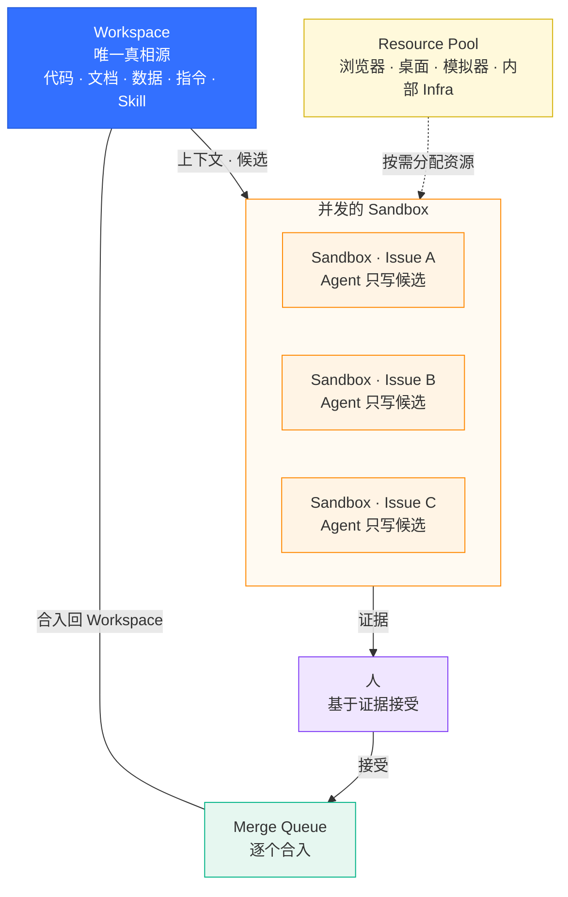
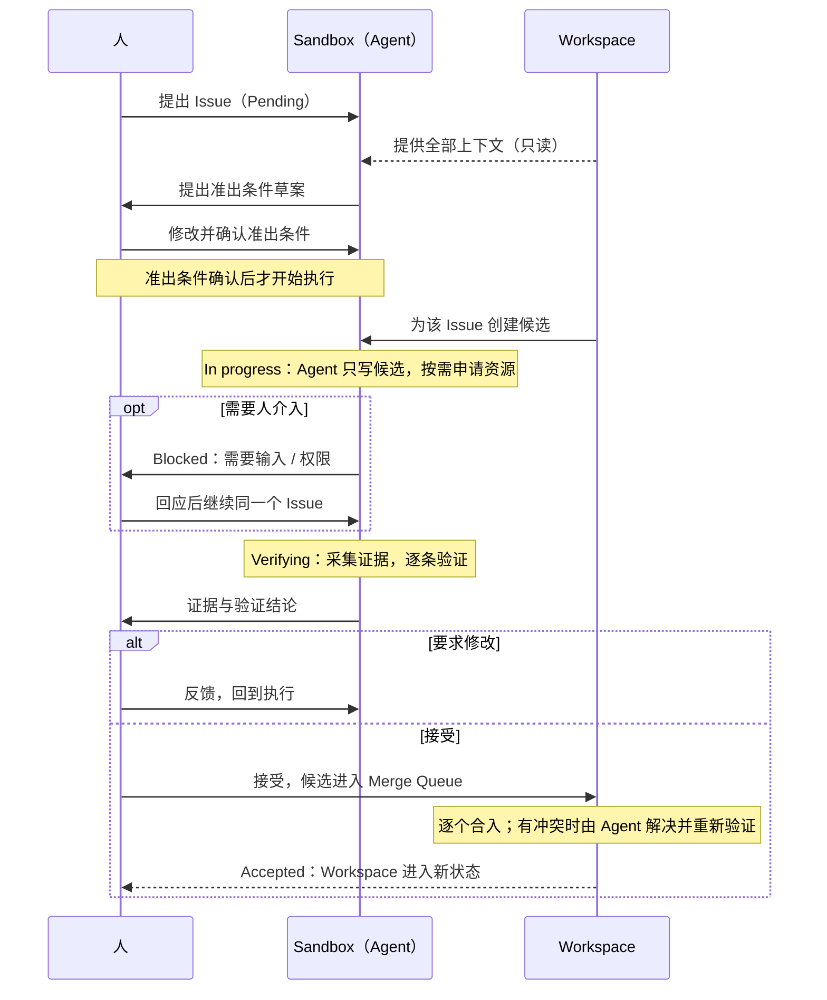
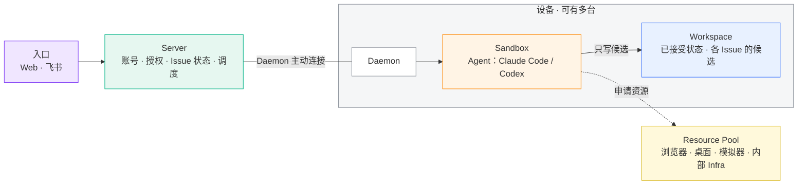

# 以 Workspace 为中心的 Agent 协作平台：理念与技术方案

> [!IMPORTANT]
> **本文是总纲（v0.6）。** 这套系统的主体是 Issue：人提出一个 Issue，Agent 在 Sandbox 中完成并拿出证据，经人接受后合入 Workspace。前三章讲清整体框架（核心理念、Issue 生命周期、部署架构），之后按模块简述，细节放在各模块的子文档中（待补充）。**全文只使用术语表中的名称，一个事物只用一个名字。**

## 一、核心理念

整套设计围绕两个概念展开：一个 Workspace 持续演进；多个 Issue 在各自的 Sandbox 中并发执行，被接受的成果逐个合入 Workspace，成为下一个 Issue 的起点。

### Workspace：唯一真相源

- **只有被接受的候选才能合入。** 日志、证据可以存放在别处，但不能成为另一份“已交付状态”。
- **成果与方法一起积累。** 代码、文档、数据是成果；指令文件、测试脚本、检查清单、Skill 是方法。两者走同一套流程进入 Workspace，下一个 Issue 直接在这些积累之上开始。
- **人在两端。** 开始时，人与 Agent 敲定准出条件；结束时，人基于证据决定接受或放弃。

### Sandbox：给 Agent 能力，也给 Agent 边界

- **能力：** Agent 能读写文件、执行命令、使用 Skill，并通过 Resource Pool 使用浏览器、桌面、模拟器等资源，采集证据证明自己完成了任务。
- **边界：** Agent 只写候选，不直接修改 Workspace。它的进程受隔离约束，凭据不外泄，权限不超过发起 Issue 的人。
- **无记忆：** 每个 Issue 都从零开始。需要长期保留的东西，经接受后合入 Workspace。

### 术语表

#### 核心概念

| 术语      | 含义                                                           |
| --------- | -------------------------------------------------------------- |
| Workspace | 已接受状态的唯一真相源：一个文件系统目录，可以包含多个仓库     |
| Sandbox   | Agent 执行一个 Issue 的受控环境：提供能力，也施加隔离          |
| Issue     | 人提出的一个目标，连同它的准出条件，以及围绕它的全部工作       |
| 人        | 使用系统的账号持有者：提出 Issue、确认准出条件、决定接受或放弃 |
| Agent     | 执行 Issue 的 AI，目前是 Claude Code 或 Codex                  |
| Skill     | 可复用的工作方法包；每个 Workspace 自己选择启用哪些            |

#### Issue 流程

| 术语        | 含义                                                                                                                          |
| ----------- | ----------------------------------------------------------------------------------------------------------------------------- |
| 准出条件    | Agent 结合 Workspace 上下文与人敲定、由人确认的完成条件                                                                       |
| 候选        | 某个 Issue 独有的一份 Workspace 副本（git worktree）；Agent 只写候选                                                          |
| 证据        | 对候选实际运行命令、测试、页面操作等得到的原始记录                                                                            |
| 验证        | 依据证据，对每条准出条件给出“通过 / 失败 / 无法判断”的结论                                                                    |
| 接受        | 人根据证据和验证，决定让某个候选合入 Workspace                                                                                |
| 合入        | 已接受的候选经 Merge Queue 写入 Workspace                                                                                     |
| Merge Queue | 每个 Workspace 一条的合入队列，保证逐个合入                                                                                   |
| Issue 状态  | Pending（待开始）· In progress（执行中）· Blocked（需要人介入）· Verifying（验证中）· Accepted（已合入）· Abandoned（已放弃） |

#### 资源与组件

| 术语          | 含义                                                                               |
| ------------- | ---------------------------------------------------------------------------------- |
| Resource Pool | Agent 可以申请使用的资源清单，负责资源的分配、独占与回收                           |
| 资源          | Resource Pool 中的一项：一个浏览器、一台桌面机器、一台模拟器或真机、一个内部服务等 |
| 入口          | 人使用系统的界面：Web 和飞书                                                       |
| 账号          | 人在系统中的身份，默认使用飞书身份                                                 |
| Server        | 负责账号、授权、Issue 状态与调度的服务                                             |
| 设备          | 运行 Daemon、Sandbox 和 Workspace 的机器，可以有多台                               |
| Daemon        | 设备上的常驻进程，主动连接 Server，在本机执行                                      |

## 二、Issue 生命周期

Issue 是这套系统的主体。一个 Issue 从提出到合入 Workspace 的全过程如下：

### 2.1 第一步：敲定准出条件

这是整个生命周期中最关键、也最靠前的一步。Agent 接到 Issue 后，先结合 Workspace 的全部上下文，提出一份准出条件草案，再和人一起修改，最后由人确认。**准出条件确认之前，Agent 不开始执行。** 之后如果要修改准出条件，必须写明理由，并由人重新确认，Agent 不能为了让验证通过而降低标准。

一份准出条件由 Issue 的目标、范围（做什么、不做什么）、约束，以及若干条具体条件组成。每一条条件大致包含：

| 组成     | 说明                                                                                              |
| -------- | ------------------------------------------------------------------------------------------------- |
| 陈述     | 用自然语言写出的、可观察的完成条件；标明是否必需                                                  |
| 证明类型 | 这条条件要证明什么：功能、视觉交互、质量、数据正确性、内容完整性、约束符合性等                    |
| 判定方式 | 确定性检查（程序根据结果判定），或 Agent 判定（按评判细则独立判断）                               |
| 证据要求 | 需要什么形式的证据（日志、图片、视频、HTTP 交互、测试报告、文档等）、至少几份、是否必须由系统采集 |
| 检查程序 | 可选；例如一条命令、一次 HTTP 请求，用来产生证据并给出结论                                        |

每次修改都会生成准出条件的新版本，人确认的是某一个具体版本。

> 字段细节见子文档《准出条件》（TODO）

### 2.2 其余阶段

- **执行（In progress）：** Agent 在 Sandbox 中只写候选，按需从 Resource Pool 申请资源。
- **需要人介入（Blocked）：** 只有确实需要人时才进入 Blocked，并且必须写明原因（需要输入 / 需要权限 / 系统错误）。人回应后，继续执行同一个 Issue。
- **验证（Verifying）：** 按准出条件采集证据，逐条验证（见第五章）。
- **接受与合入（Accepted）：** 人基于证据接受后，候选进入 Merge Queue 逐个合入（见第六章）。
- **放弃（Abandoned）：** 只有人可以放弃 Issue。放弃后候选不合入，历史保留。

## 三、部署架构

| 模块          | 负责                                              | 不负责                   |
| ------------- | ------------------------------------------------- | ------------------------ |
| 入口          | 提出 Issue、敲定准出条件、查看证据、接受或放弃    | 保存 Issue 状态          |
| Server        | 账号、授权、Issue 状态、调度、审计                | 持有凭据；替人运行 Agent |
| Daemon        | 连接 Server、在设备上调度 Sandbox、创建候选、合入 | 决定是否接受             |
| Sandbox       | 运行 Agent，提供能力，施加隔离                    | 直接修改 Workspace       |
| Resource Pool | 管理资源清单，负责分配、独占、回收                | 决定 Issue 是否完成      |

几个关键取舍：

- **Daemon 主动连接 Server。** 设备不需要开放入站端口；设备可以是个人电脑，也可以是远程机器。
- **只通过 Claude Code / Codex 官方的 SDK 或 CLI 使用模型。** 不自研 Agent 的执行循环。
- **内部 Infra 通过封装接入。** 资源、账号等需要对接大量内部 Infra，框架层只定义统一接口，具体 Infra 各自实现接入，不让框架依赖某一种具体 Infra。

## 四、Sandbox

### 4.1 隔离

| 隔离层     | 隔离什么                                          | 手段                                                                        |
| ---------- | ------------------------------------------------- | --------------------------------------------------------------------------- |
| 文件       | 并发的 Issue 互不覆盖；Workspace 只能通过合入改变 | 每个 Issue 一个候选                                                         |
| 进程       | 进程能读写的范围、能访问的网络                    | macOS sandbox-exec、Linux bubblewrap、Docker 容器；不满足隔离条件时拒绝执行 |
| Skill      | Agent 能看到哪些 Skill                            | 只暴露 Workspace 启用的 Skill，设备上的个人 Skill 不可见                    |
| 凭据       | 模型与内部服务的凭据                              | 留在设备或受控的密钥存储中，不交给 Agent 明文                               |
| 身份       | Agent 能以谁的名义操作                            | Agent 的权限不超过发起 Issue 的人                                           |
| 外部副作用 | 部署、发消息、写外部数据                          | 需要执行当时单独授权；接受不能追认此前的副作用                              |
| 资源       | 多个 Issue 争用同一资源                           | 由 Resource Pool 分配和独占（见 4.2）                                       |

> [!CAUTION]
> 候选只隔离文件，不隔离进程、端口和外部状态，所以必须叠加其他隔离层。

### 4.2 能力：Resource Pool

Agent 自带读写文件、执行命令、使用 Skill 的能力。除此之外，它还需要的各种资源都统一由 Resource Pool 提供。Resource Pool 是 Agent 可以申请的资源清单，负责分配、独占、回收和故障恢复，保证一个资源同一时间只被一个 Issue 使用，用完后清理干净。

| 资源          | 例子                         | 用途                               |
| ------------- | ---------------------------- | ---------------------------------- |
| 浏览器        | 受控的浏览器实例             | Web 页面操作、截图、录屏           |
| 桌面          | 某一台指定的机器             | Computer Use 类的桌面操作          |
| 模拟器 / 真机 | iOS 模拟器、Android 真机     | 移动端安装、操作、截图             |
| 端口与服务    | 本地端口、测试环境、内部服务 | 启动被测服务、调用依赖             |
| 内部 Infra    | 各类内部平台与服务           | 通过封装接入，作为资源提供给 Agent |

资源的形态差别很大：浏览器可以放进容器，而 Computer Use 往往需要一台具体的机器，不适合 Docker。所以 Resource Pool 只统一“申请 → 使用 → 释放 → 清理”这条生命周期，每种资源怎么提供、怎么隔离，由各自的实现决定。

> 细节见子文档《Sandbox 隔离》《Resource Pool》（TODO）

## 五、证据与验证

- **证据是原始记录，不是 Agent 的自述。** 命令输出、测试报告、HTTP 交互、截图、录屏等，都由系统实际采集。
- **证据与验证分开保存。** 验证引用证据给出结论；后来的验证不会覆盖先前的证据。
- **验证方式按准出条件来。** 确定性检查由程序判定；需要判断的，由一个独立的 Agent 只读地判定；人可以在 Agent 判定之上改判。
- **不确定就不算通过。** 缺失、失败、无法判断或已过期的证据，都不能算作通过。候选变化后，旧证据自动过期。

> 细节见子文档《证据与验证》（TODO）

## 六、接受与合入

### 6.1 接受

人查看准出条件、证据、验证结论和候选的改动，然后决定接受、要求修改或放弃。只有有权限的人才能接受；Agent 不能自己接受，也不能自己放弃。人接受的是一份具体的候选，候选变化后，之前的接受失效。

### 6.2 合入

1. 被接受的候选进入该 Workspace 的 Merge Queue。
2. 按顺序逐个合入；合入前，先把候选对齐到 Workspace 的最新状态。
3. 如果有冲突，由 Agent 在候选中自行解决，然后重新验证。
4. 所有仓库都合入成功后，Issue 才标为 Accepted；中途失败时，停止后续合入并保留现场，便于恢复。

> 细节见子文档《接受与合入》（TODO）

## 七、入口与账号

- **入口：** Web 和飞书。飞书群绑定一个 Workspace，群内话题对应一个 Issue。在飞书中可以发起 Issue、跟进进度、回应 Blocked；复杂的证据查看和接受，回到 Web 完成。
- **账号：** 默认以飞书身份作为账号，与飞书打通。Workspace 按角色共享，能查看或提出 Issue 不等于能接受；所有入口都走同一套授权判断。

> 细节见子文档《入口与账号》（TODO）
